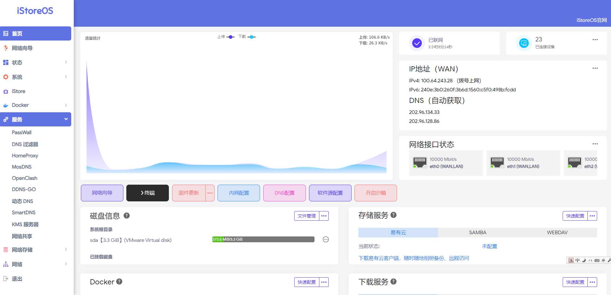
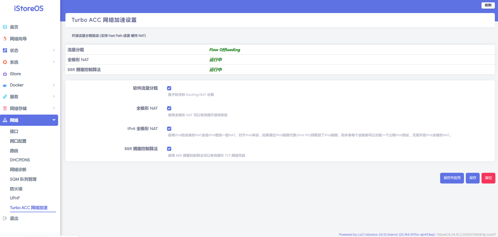

# iStore OS 固件 | 

 

## 基本状况
| 系统支持                      | 状态 |
|:----------------------------:|:----:|
| 支持OTA在线升级                | ✅  |

## 界面

| 内置插件                 | 状态 | 内置插件         | 状态 |
|:------------------------:|:----:|:----------------:|:----:|
| PassWall                 | ✅   | iStoreOS界面     | ✅   |
| HomeProxy                | ✅   | TTY 终端         | ✅   |
| pushbot                  | ✅   |  Docker          | ✅   |
| openclash                | ✅   | DiskMan 磁盘管理 | ✅   |
| MosDNS                   | ✅   | Socat端口转发           | ✅   |
| 动态 DNS                 | ✅   | UPnP            | ✅   |
| DDNS-GO                 | ✅   | mwan3负载均匀            | ✅   |
| smartdns                | ✅   | turboacc网络加速         | ✅   |
| FRP 客户端               | ✅   | taskplan任务设置         | ✅   |
| 网络共享（Samba）        | ✅   |  iStore商店      | ✅   |
| filebrowser              | ✅   |               | ⏳   |

✅ 可用

❌ 不可用

⏳ 计划中

## 默认配置

- IP: `http://192.168.2.1` or `http://iStoreOS.lan/`
- 用户名: `root`
- 密码: `password`
- 如果设备只有一个网口，则此网口就是 `LAN` , 如果大于一个网口, 默认第一个网口是 `WAN` 口, 其它都是 `LAN`
- 如果要修改 `LAN` 口 `IP` , 首页有个内网设置，或者用命令 `quickstart` 修改
- 北京时间每天 `0:00` 定时编译, `Release` 中最新版本支持OTA每日更新升级
## 支持架构

### x86 架构

| 启动       | 包名称                                              |
| ---------- | --------------------------------------------------- |
| X86-64     | istoreos-x86-64-generic-squashfs-combined.img.gz    |
| X86-64-EFI | storeos-x86-64-generic-squashfs-combined-efi.img.gz |

## 鸣谢

- [iStoreOS](https://github.com/istoreos/istoreos)
- [ImmortalWrt](https://github.com/immortalwrt/immortalwrt)
- [P3TERX/Actions-OpenWrt](https://github.com/P3TERX/Actions-OpenWrt)
- [Microsoft Azure](https://azure.microsoft.com)
- [GitHub Actions](https://github.com/features/actions)
- [OpenWrt](https://github.com/openwrt/openwrt)
- [Lean&#39;s OpenWrt](https://github.com/coolsnowwolf/lede)
- [tmate](https://github.com/tmate-io/tmate)
- [mxschmitt/action-tmate](https://github.com/mxschmitt/action-tmate)
- [csexton/debugger-action](https://github.com/csexton/debugger-action)
- [Cowtransfer](https://cowtransfer.com)
- [WeTransfer](https://wetransfer.com/)
- [Mikubill/transfer](https://github.com/Mikubill/transfer)
- [softprops/action-gh-release](https://github.com/softprops/action-gh-release)
- [ActionsRML/delete-workflow-runs](https://github.com/ActionsRML/delete-workflow-runs)
- [dev-drprasad/delete-older-releases](https://github.com/dev-drprasad/delete-older-releases)
- [peter-evans/repository-dispatch](https://github.com/peter-evans/repository-dispatch)
